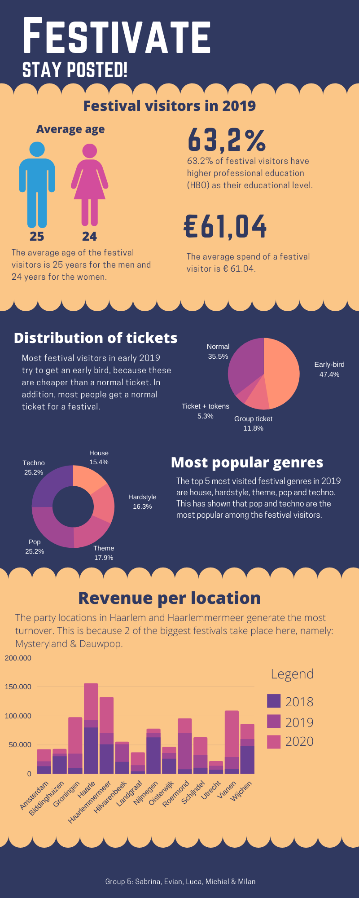
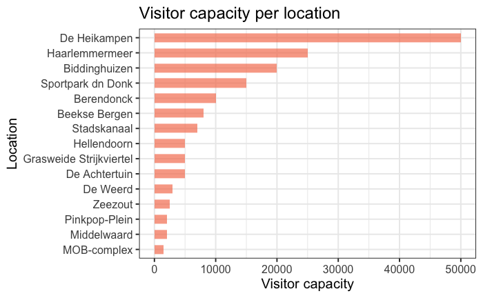
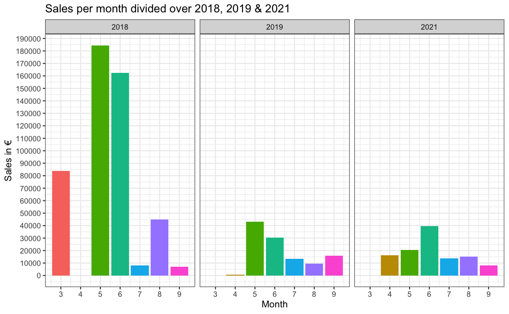
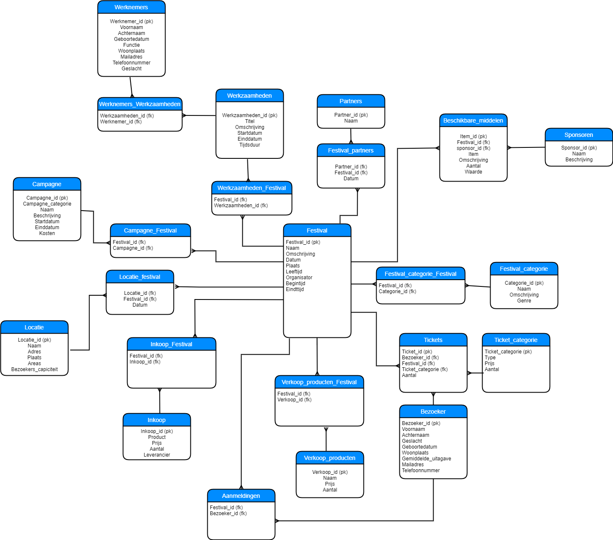

## Festivate: Exploratory Data Analysis (EDA)

For this school project my group members and I started a fictional company called Festivate to help fictional festival organizers to gain more insights from their data in order to help with decision making. I designed the SQL database for this project for the festival organizers and used R to manipulate and visualize data.

* Designed a SQL database with 23 tables for the festival organizers
* Used SQL to write queries to gain insights about revenue, logistics, festivals and festival visitors
* Used also R for the Exploratory Data Analysis (EDA) to modify en visualize data in order to extract insights

**Link to my EDA:**
https://mlp99.github.io/Festivate-EDA/

## Goal:
The goal of this school project was to create a fact sheet that contains essential information that was discovered during multiple data analysis each group member did.

## Some findings:

## Database design that was used in this project:
**ONE IMPORTANT NOTE: the database tables are in Dutch.**

